# AI-Based Payment Routing System

## Overview

The **AI-Based Payment Routing System** is a solution designed to optimize payment routing for transactions processed through payment gateways in Nigeria. Flutterwave is used as case study for this project. By leveraging machine learning and contextual bandit algorithms, the system intelligently selects the optimal payment pathway (e.g., Card_Visa, Bank_Transfer_GTBank, USSD_MTN) to minimize costs, reduce latency, and maximize success rates. The system is made for the Nigerian fintech ecosystem, addressing local challenges such as network instability and varying processor performance.

This project integrates **Random Forest** for predictive modeling and **Thompson Sampling Contextual Bandits** for adaptive learning, ensuring robust decision-making. It includes comprehensive **Exploratory Data Analysis (EDA)** with 14 visualizations (10 for transaction data, 4 for model evaluation), a **Gradio-based GUI** for user interaction, and a **feedback loop** for continuous model improvement. 

## Features

- **Intelligent Routing**: Selects optimal payment pathways based on cost (weight: 0.4), latency (0.3), and success rate (0.3).
- **Machine Learning Models**:
  - **Random Forest Classifier**: Predicts the best pathway using historical transaction and processor metrics data.
  - **Thompson Sampling Contextual Bandit**: Adapts to real-time transaction outcomes for dynamic optimization.
- **Exploratory Data Analysis (EDA)**: Generates 10 visualizations for transaction and processor metrics analysis, with PNG and Chart.js outputs.
- **Model Evaluation**: Produces 4 visualizations, including confusion matrix and feature importance, to assess model performance.
- **Flutterwave Integration**: Simulates API calls to Flutterwave's payment processing endpoints with retry logic.
- **Gradio GUI**: User-friendly interface for testing transaction routing with customizable inputs.
- **Feedback Loop**: Updates processor metrics and retrains models based on transaction outcomes (retraining triggered with 1% probability per transaction).
- **Robust Error Handling**: Includes logging, data validation, and fallback mechanisms (default pathway: Card_Verve).
- **Caching**: Optimizes preprocessing and data merging for performance in Google Colab.
- **Nigeria-Specific**: Supports 10 payment pathways (e.g., Card_Visa, USSD_Airtel, Mobile_Money_OPay) and local merchant types (Retail, E-commerce, etc.).

## Project Structure

```
├── docs/
│   ├── images/
│   │   ├── transaction_amount_histogram.png
│   │   ├── amount_by_merchant_boxplot.png
│   │   ├── amount_by_payment_violin.png
│   │   ├── transaction_pairplot.png
│   │   ├── transaction_location_bar.png
│   │   ├── metrics_correlation_heatmap.png
│   │   ├── latency_by_pathway_boxplot.png
│   │   ├── success_rate_by_pathway_violin.png
│   │   ├── pathway_usage_bar.png
│   │   ├── latency_time_series.png
│   │   ├── rf_feature_importance.png
│   │   ├── rf_confusion_matrix.png
│   │   ├── cb_reward_distribution.png
│   │   ├── cb_reward_bar.png
├── payment_routing_system.py
├── README.md
├── config.yaml
├── transaction_data.csv
├── processor_metrics.csv
```

## Installation

### Prerequisites
- Python 3.11+
- Google Colab (recommended for interactive execution)
- GitHub account for repository cloning
- Dependencies: `pandas`, `numpy`, `scikit-learn`, `pyyaml`, `gradio`, `requests`, `matplotlib`, `seaborn`, `ipython`

### Setup
1. **Clone the Repository**:
   ```bash
   git clone https://github.com/oluwaseun-odufisan/Payment-Routing-System.git
   cd Payment-Routing-System
   ```

2. **Install Dependencies**:
   Run the following in a Google Colab cell or local environment:
   ```bash
   !pip install pandas numpy scikit-learn pyyaml gradio requests matplotlib seaborn ipython
   ```

3. **Prepare Data**:
   - The system generates synthetic data if `transaction_data.csv` or `processor_metrics.csv` are missing.
   - To use custom data, ensure CSV files follow the schema in `DataPreparation` class (see [Code Structure](#code-structure)).

4. **Run the System**:
   - In Google Colab, upload `payment_routing_system_colab_fixed_v4.py` and execute all cells.
   - Alternatively, run locally:
     ```bash
     python payment_routing_system_colab_fixed_v4.py
     ```

## Usage

1. **Initialize the System**:
   - The `PaymentRoutingSystem` class orchestrates data loading, EDA, preprocessing, model training, and GUI creation.
   - Run the main script to perform EDA and train models:
     ```python
     system = PaymentRoutingSystem()
     system.initialize()
     ```

2. **Launch the Gradio GUI**:
   - After initialization, launch the GUI to test transactions:
     ```python
     iface = create_gui(system)
     iface.launch()
     ```
   - Input transaction details (e.g., amount, payment method) and select the model (Random Forest or Thompson Sampling).

3. **Process Transactions**:
   - The system selects an optimal pathway and simulates a Flutterwave API call.
   - Results include transaction status, pathway, cost, latency, and success rate.

4. **View Visualizations**:
   - All visualizations are saved in `/content/` (Colab) or `docs/images/` (local) and displayed inline.
   - Chart.js configurations are saved as JSON files for web-based visualization.

## Visualizations

The system generates 14 visualizations to provide insights into transaction data and model performance. All images are saved in `docs/images/` and available as Chart.js configurations for interactive use.

### Transaction Data Analysis (EDA)
1. **Transaction Amount Histogram**:
   - Displays the distribution of transaction amounts (NGN).
   - 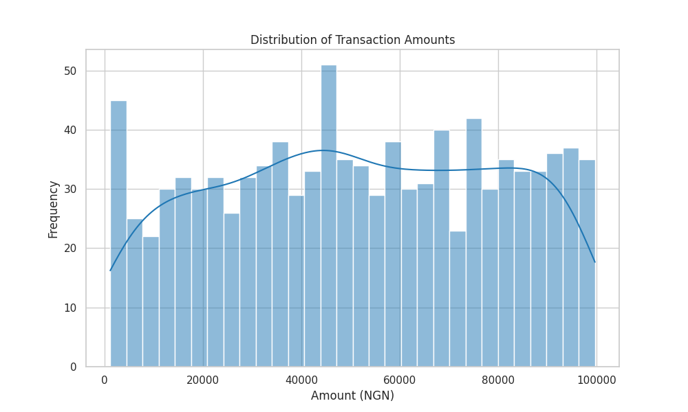
2. **Amount by Merchant Type Boxplot**:
   - Shows transaction amount variations across merchant types (e.g., Retail, E-commerce).
   - 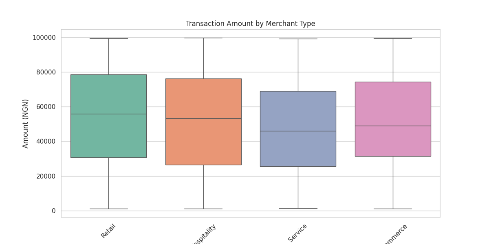
3. **Amount by Payment Method Violin Plot**:
   - Visualizes amount distributions by payment method (e.g., Card, USSD).
   - 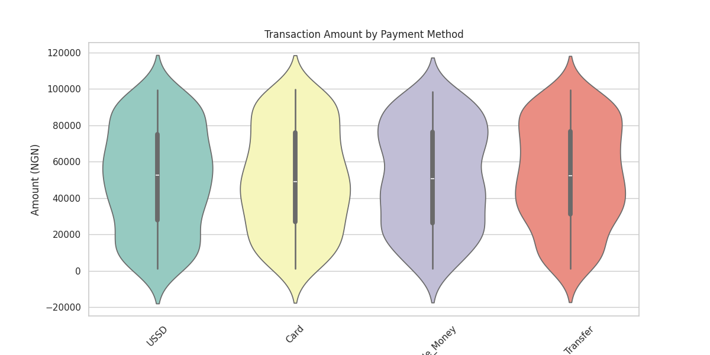
4. **Transaction Pair Plot**:
   - Explores relationships between numerical features (amount, fraud_risk_score).
   - 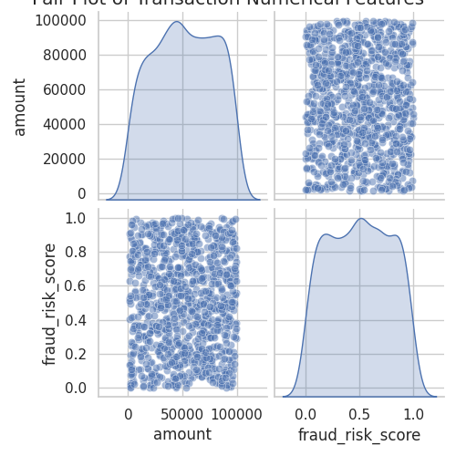
5. **Transaction Counts by Customer Location**:
   - Shows transaction frequency by location (e.g., Lagos, Abuja).
   - 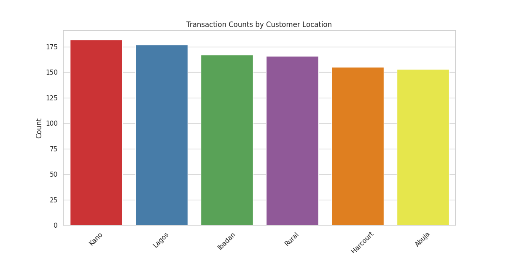
6. **Metrics Correlation Heatmap**:
   - Displays correlations between processor metrics (cost, latency, success_rate, network_stability).
   - 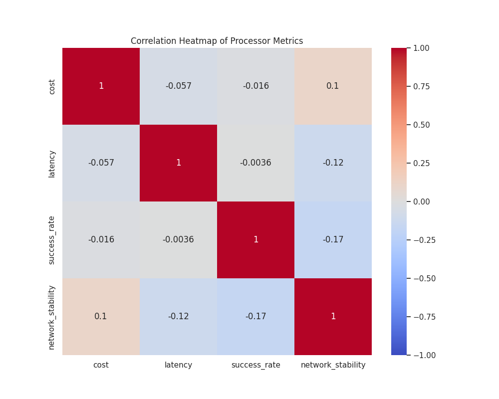
7. **Latency by Processor Pathway Boxplot**:
   - Compares latency across pathways (e.g., Card_Visa, Mobile_Money_OPay).
   - 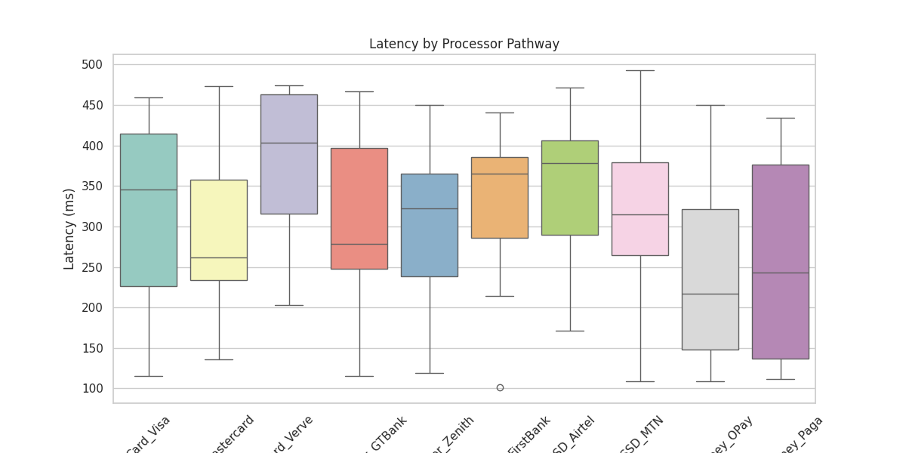
8. **Success Rate by Processor Pathway Violin Plot**:
   - Visualizes success rate distributions by pathway.
   - 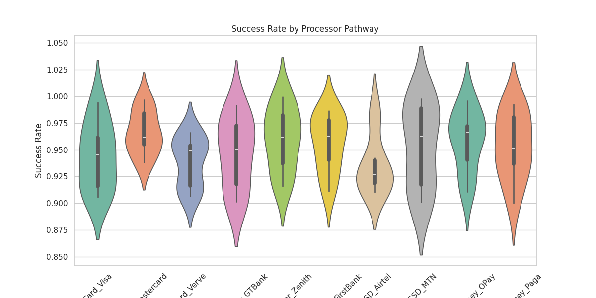
9. **Pathway Usage Frequency Bar Chart**:
   - Shows the frequency of each pathway's usage.
   - 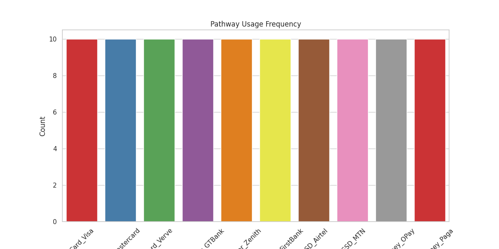
10. **Latency Over Time by Pathway**:
    - Tracks latency trends over time for each pathway.
    - 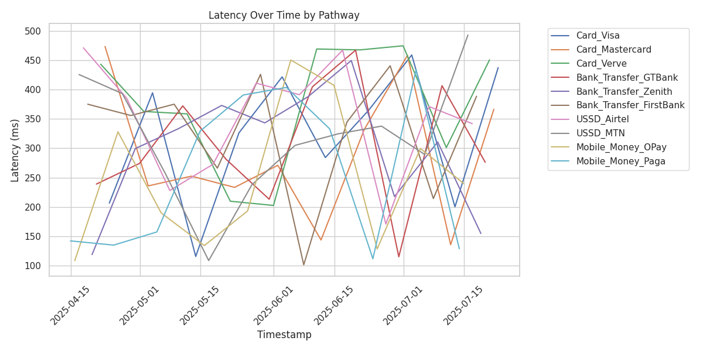

### Model Evaluation
11. **Random Forest Feature Importance**:
    - Highlights the most influential features for pathway prediction.
    - 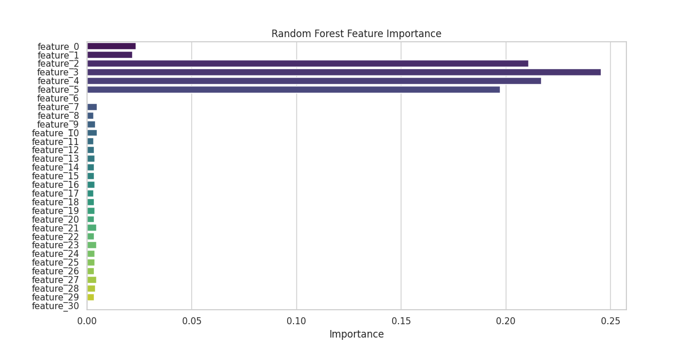
12. **Random Forest Confusion Matrix**:
    - Shows prediction accuracy across pathways.
    - 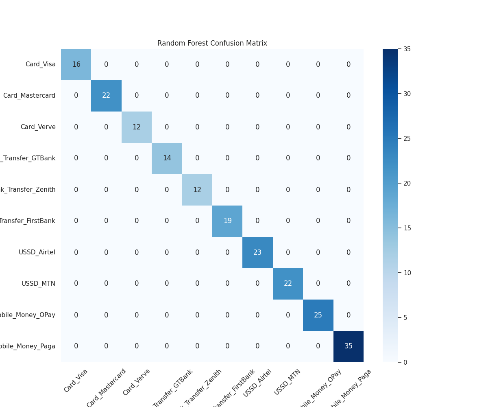
13. **Thompson Sampling Reward Distribution**:
    - Visualizes reward distributions for each pathway.
    - 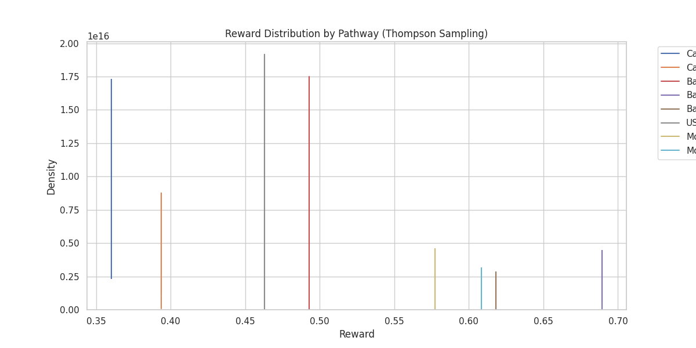
14. **Thompson Sampling Average Reward**:
    - Compares average rewards across pathways.
    - 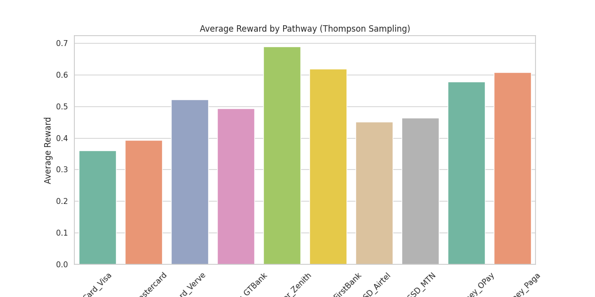

## Code Structure

The main script (`payment_routing_system_colab_fixed_v4.py`) is modular and includes the following components:

1. **Config**: Manages configuration settings (e.g., file paths, model parameters, weights) via `config.yaml`.
2. **DataPreparation**: Loads, validates, and merges transaction and processor metrics data, generating synthetic data if needed.
3. **EDA**: Performs exploratory data analysis with 10 visualizations.
4. **DataPreprocessor**: Handles data preprocessing with StandardScaler and OneHotEncoder, caching for efficiency.
5. **PaymentModel**: Trains and evaluates Random Forest and Thompson Sampling models, with 4 evaluation visualizations.
6. **RoutingEngine**: Selects optimal pathways based on model predictions and processor availability.
7. **TransactionProcessor**: Simulates Flutterwave API calls with retry logic.
8. **FeedbackLoop**: Updates metrics and retrains models based on transaction outcomes.
9. **PaymentRoutingSystem**: Put together the entire workflow.
10. **create_gui**: Provides a Gradio interface for testing.

## Technical Details

- **Data Schema**:
  - **Transaction Data**: Includes `transaction_id`, `amount`, `currency`, `merchant_id`, `merchant_type`, `customer_location`, `payment_method`, `transaction_time`, `device_type`, `network_type`, `fraud_risk_score`, `transaction_type`, `customer_id`, `processor_pathway`.
  - **Processor Metrics**: Includes `processor_pathway`, `cost`, `latency`, `success_rate`, `timestamp`, `network_stability`, `availability`, `failure_reason`.
- **Models**:
  - **Random Forest**: Uses GridSearchCV with parameters `n_estimators=[100, 150]`, `max_depth=[10, None]`, `min_samples_split=[2]`.
  - **Thompson Sampling**: Implements contextual bandits with LinearRegression per pathway, updating rewards based on weighted metrics.
- **Weights**: Cost (0.4), latency (0.3), success rate (0.3).
- **Fallback Pathway**: Card_Verve for unavailable or invalid pathways.
- **Serialization Fix**: Uses a custom `NumpyJSONEncoder` to handle NumPy types (`int64`, `float64`) in Chart.js configurations.
- **Error Handling**: Includes logging, retry logic (3 attempts, 1-second delay), and fallback mechanisms.
- **Visualization Outputs**: PNG images and Chart.js JSON configurations for all plots.

## For Fintech Researchers and Industry Professionals

This system is designed to address real-world payment routing challenges in Nigeria's fintech industry:
- **Scalability**: Modular design supports integration with additional processors or payment gateways.
- **Adaptability**: Thompson Sampling ensures the system learns from real-time transaction outcomes, ideal for dynamic environments.
- **Cost Optimization**: Prioritizes cost (weight: 0.4) to align with fintech business objectives.
- **Robustness**: Handles missing data, invalid pathways, and API failures gracefully.
- **Extensibility**: Chart.js configurations enable integration with web-based dashboards for real-time monitoring.
- **Research Applications**: The EDA and model evaluation visualizations provide deep insights into transaction patterns and model performance, suitable for academic and industry research.

To extend the system:
- Replace the Flutterwave API.
- Add new pathways or modify weights in `config.yaml`.
- Integrate with other ML models (e.g., XGBoost, Neural Networks) in the `PaymentModel` class.
- Deploy the Gradio GUI as a web service for production use.

## Contact

For questions, contact me at oluwaseun.odufisan@gmail.com
